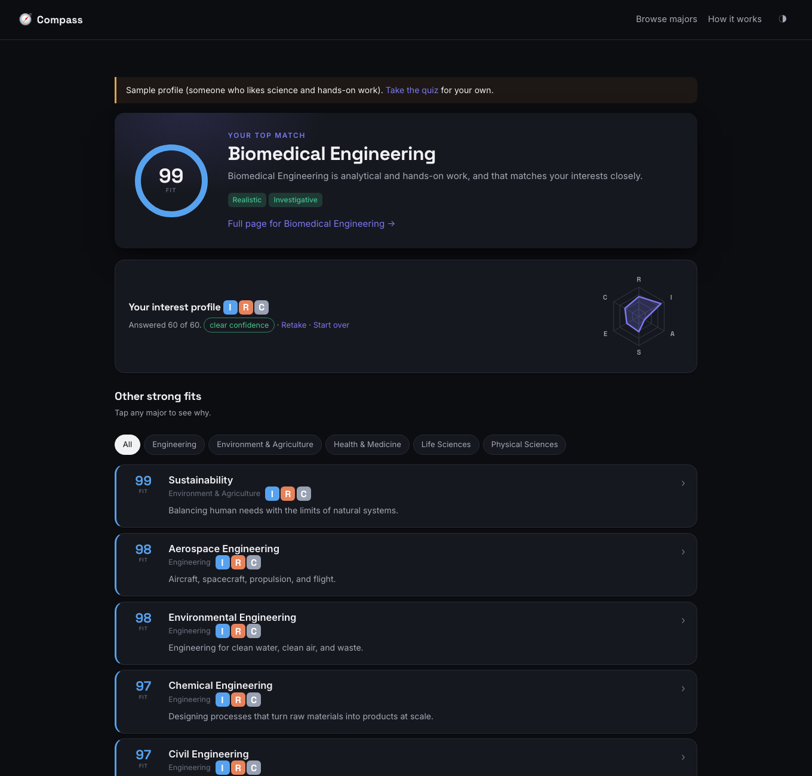
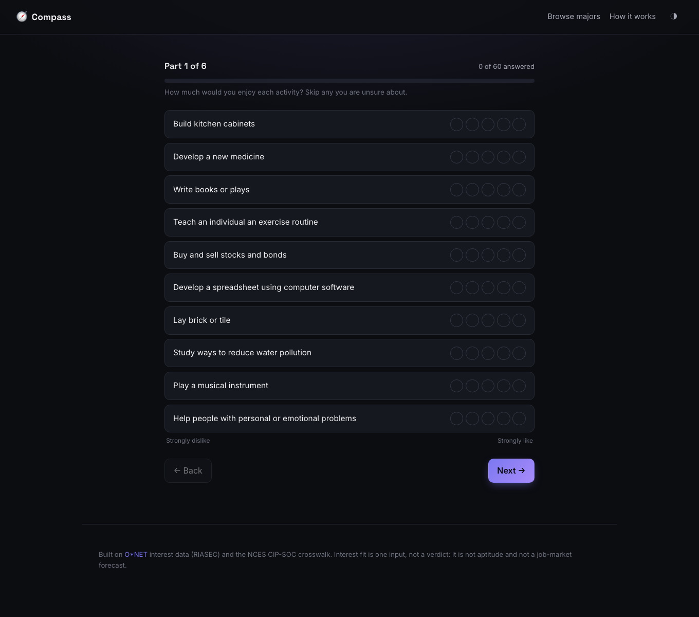
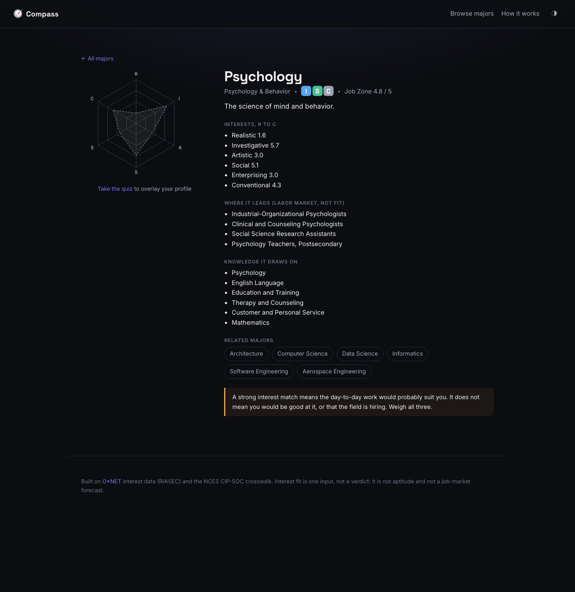

# Compass

Recommend college majors from your interests, using the RIASEC interest data
that career counselors actually use, and show the reasoning behind every match.

<p align="center">
  
</p>

```bash
pip install -e .
compass serve          # dashboard at http://127.0.0.1:8791
compass quiz           # or take it in the terminal
```

## Why I built this

I had to declare a major and every quiz I found was a black box: ten vague
questions, a one-word answer, no explanation. The tools that professionals use,
built on decades of vocational-interest research, sit behind government websites
and never quite get to the question a 17-year-old is asking, which is "what
should I study."

Compass closes that gap. It runs the real instrument (the O*NET Interest
Profiler), profiles 112 college majors from the same interest data, ranks them
for you, and then, for every recommendation, tells you which of your answers
drove it and where you and the major do not line up.

## What it does

| | |
|---|---|
| **Runs the real questionnaire** | The 60-item O*NET Interest Profiler Short Form, a validated instrument from the US Department of Labor. Your answers become six scores, one per Holland interest type (Realistic, Investigative, Artistic, Social, Enterprising, Conventional). |
| **Profiles majors from government data** | Each major's interest profile is built from the O*NET database: the CIP-to-SOC crosswalk maps the major to the occupations it leads to, and their RIASEC ratings are averaged. |
| **Ranks with a transparent score** | The 0-100 fit score blends the correlation between your profile shape and the major's with how well your top-three interest code matches theirs. No black box, no machine learning. |
| **Shows its work** | Every recommendation names the interests you share, the ones the major needs that you rated low, and the individual activities that moved the score, with a sensitivity check on each. |
| **Handles dealbreakers** | Mark an interest you never want to use and majors that lead with it drop down the list. |
| **Is honest about limits** | Interest fit is one signal. The major pages show labor-market context separately and clearly labeled, and a flat or half-finished profile is reported as low-confidence. |
| **CLI too** | `compass quiz`, `compass major`, `compass compare` for the terminal. |

## Screenshots

| The questionnaire | A major's page |
|---|---|
|  |  |

## Quickstart

```bash
git clone https://github.com/Samprit67/compass
cd compass
python -m venv .venv && source .venv/bin/activate
pip install -e ".[dev]"

compass serve                  # web dashboard
compass quiz --limit 30        # a shorter terminal run
```

No data downloads: the 112 major profiles and the questionnaire are committed to
the repo (`compass/data/`). Rebuilding them from the official sources is
`compass data refresh` (needs the `data` extra).

## How the fit score works

Every constant is in [`compass/model/params.py`](compass/model/params.py) and the
full write-up is in [`docs/METHODOLOGY.md`](docs/METHODOLOGY.md). In short:

1. **Your profile.** Average your answers within each of the six interests, on
   the 0-4 scale. The spread between your highest and lowest interest is your
   *differentiation*; a flat profile is not informative and Compass says so.
2. **Shape match.** The Pearson correlation between your six scores and the
   major's six, rescaled to 0-1. This compares the *pattern* of your interests,
   not the overall level, so liking everything a little and liking your
   favourites a lot give the same shape.
3. **High-point match.** How well your top three interests line up with the
   major's, scored as an ordered three-letter code (the classic Holland
   congruence idea).
4. **Blend and adjust.** 70% shape, 30% high-point, then a multiplicative
   penalty if the major leads with a dealbreaker.

## Tech

- **Python 3.10+** · **FastAPI** + **Uvicorn** · **NumPy** for the model · **Typer** CLI
- Frontend: **vanilla ES modules**, no build step, the interest hexagon drawn by
  hand in [`compass/web/charts.js`](compass/web/charts.js)
- Data: **O*NET 31.0** and the **NCES CIP-SOC crosswalk**, parsed by
  [`compass/data/refresh.py`](compass/data/refresh.py). Runtime deps are just
  `pyyaml` plus the web stack.
- Tooling: **ruff**, **mypy** (strict on the model), **pytest** + **Hypothesis**,
  **GitHub Actions**

## Testing

```bash
pytest                       # ~50 tests, offline, seconds
ruff check compass tests && ruff format --check compass tests
mypy compass
```

The model has property tests: more liking of an interest never lowers a major
led by that interest, the fit score stays in 0-100, a profile identical to a
major's own vector scores that major at the top, a dealbreaker never promotes a
major that leads with it, and a flat profile is always flagged low-confidence.
The ETL is tested against a tiny synthetic O*NET slice built in a tmpdir, so no
network and no large fixtures.

## Known limitations

- **Interest, not aptitude or outcomes.** A high fit means the day-to-day work
  would probably suit you, nothing more. Weigh ability and the job market
  separately.
- **The crosswalk is coarse for some majors.** A few interdisciplinary fields
  (Philosophy, Cognitive Science, Gender Studies) map to a single "Postsecondary
  Teachers of X" occupation. For those, a handful of related occupations are
  added by hand in [`compass/data/majors.yaml`](compass/data/majors.yaml), and
  the major is flagged as built from a thin sample.
- **US-centric.** CIP codes, SOC codes, and O*NET are US classifications.
- **112 majors, not 2,000.** The list is the set an undergraduate actually
  chooses between, not every six-digit CIP code.

## License

Code is MIT ([LICENSE](LICENSE)). The interest data is from O*NET (CC BY 4.0) and
NCES/BLS (public domain); see [NOTICE](NOTICE) and
[`docs/DATA.md`](docs/DATA.md).
